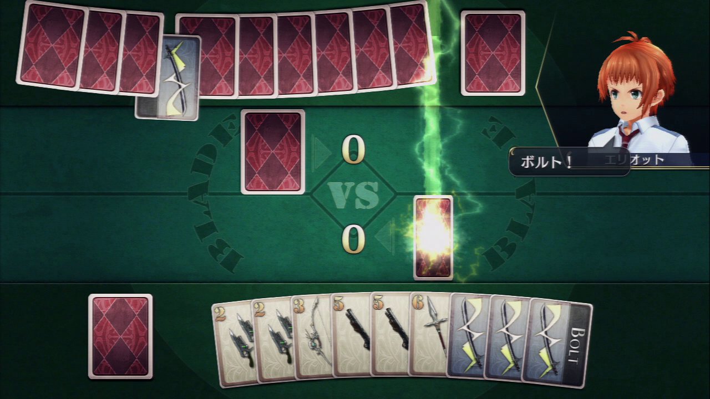

Blade-SenNoKiseki-
==================

Codegolf challenge.

# Detailed Rules

32 cards:

    CardDesignation NumberOfCards (CardsValue)
    1 2 (1)
    2 3 (2)
    3 4 (3)
    4 4 (4)
    5 4 (5)
    6 3 (6)
    7 2 (7)
    B 6 (1)
    M 4 (1)

(B=Bolt, M=Mirror)

# Hidden Cards
 - you can see:
   - the cards in your hand
   - the cards on the field (yours+opp.)
 - you cannot see:
   - the cards in your deck
   - the cards in your opponent's deck
   - the cards in the opponent's hand

# Preparation

 - Take 32 cards as described above, and split into two decks
 - 2 players, one deck of 16 cards each
 - Each player draws 10 cards from his deck
 - Goto Initialization.

# Initialization

    (deck empty, hand empty)
        - Draw
    (deck empty, hand not empty)
        - place card from hand on the field
    (deck not empty)
        - draw card, place on the field
  
 - Repeat until score is not equal.
 - Player with lower score begins.
 - Goto Turn.

# Turn

    (hand empty)
        (opponent's hand empty)
            - Calculate both player's score
                (equal)
                    - Draw
                (not equal)
                    - player with highest score Wins
                    - player with lower score Loses
        (opponent's hand not empty)
            - You Lose.
    (hand not empty)
        - place card from your hand on the field
            (card is last card, and M or B)
                - You Lose
            (otherwise)
                - Reevaluate field.
                - Calculate score.
                    (your score is lower)
                        - you lose
                    (your score is equal to the opp.)
                        - Goto Initialization.
                    (your score is higher)
                        - Goto opponent's Turn.

# Score Calculation

 - add values of all cards on your field, excluding invalidated cards

# Field Reevaluation

    (card is 2-7)
        - remove your invalidated card if applicable
    (card is M)
        - exchange field cards, including invalidated cards
    (card is B)
        - remove opponent's invalidated card if applicable
        - invalidate most recently played card on the opponent's field
    (card is 1)
        (invalidated card on your field)
            - validate this card
        (otherwise)
            - remove your invalidated card if applicable
    
# Controller

    ruby controller.rb <playerfile> <timelimit> <rounds> <quiet>

See `players.txt` for the syntax of the `playerfile`. Set quiet to `y` to suppress debug output. Set it to `n` to to get a lot of information about the match, use this for debugging or if the rules are unclear. See below for a sample match with quiet set to `n`.

# Scoring / Input / Output

See codegolf link above.

# Sample JSON input

See file `sample_json`.

# Sample match

See file `sample_match`
